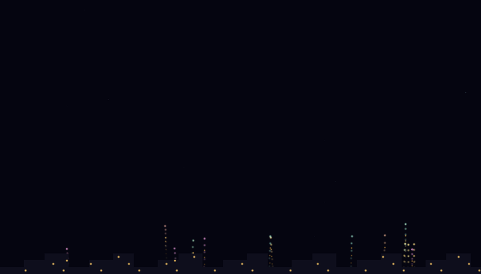
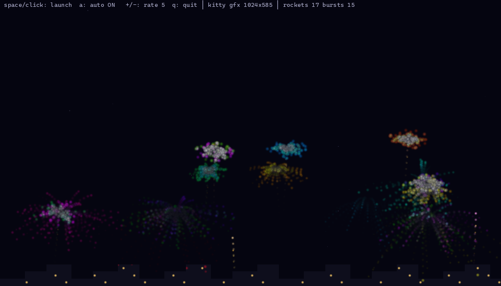
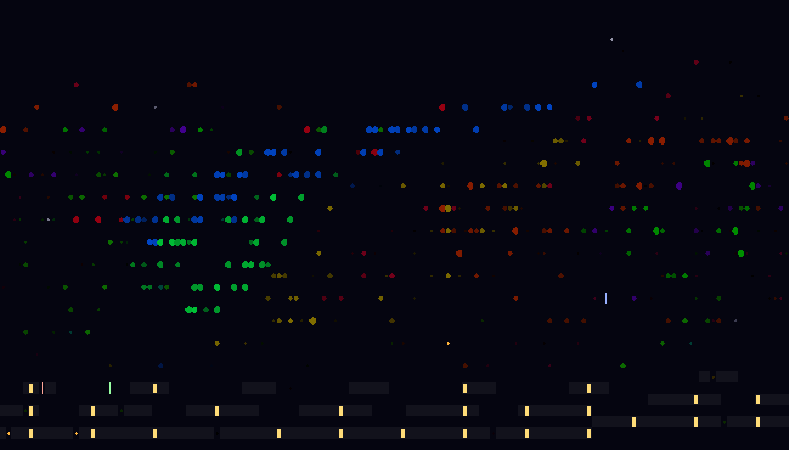

# termfun 🎆

Fireworks in your terminal — at two resolutions.



Two small C demos built on [termpaint](https://github.com/termpaint/termpaint):

- **`fireworks`** — a classic cell renderer: glyph ramps, true-color particles, a twinkling sky.
- **`fireworks-gfx`** — the same show at **pixel resolution** using the
  [kitty graphics protocol](https://sw.kovidgoyal.net/kitty/graphics-protocol/),
  with automatic fallback to cell rendering anywhere else.

No dependencies beyond a C compiler and `make` — termpaint is vendored as a
submodule and built into the binaries.

## Quick start

```sh
git clone --recurse-submodules https://github.com/binRick/termfun.git
cd termfun
make
./build/fireworks-gfx     # pixel mode in kitty/iTerm2/WezTerm, cells elsewhere
./build/fireworks         # cell mode everywhere
```

If you already cloned without `--recurse-submodules`, run
`git submodule update --init` first. `make run` and `make run-gfx` build and
launch in one step, and `./fireworks.sh` / `./fireworks-gfx.sh` do the same
including the submodule fetch.

## The demos

Every demo comes in two renderings — kitty graphics (pixels) and ASCII cells —
shown side by side below.

### fireworks

Rockets, bursts, a twinkling sky, and a city skyline. `fireworks-gfx` renders
pixels on kitty-protocol terminals and falls back to cells; `fireworks` is the
pure cell version.

#### kitty graphics — `fireworks-gfx`



Renders into an RGBA framebuffer transmitted to the terminal every frame:

- **Additive glow** — sparks are radial gradients that sum into the
  framebuffer, so overlapping bursts get hot in the middle.
- **Decay trails** — every channel decays toward zero each frame instead of
  being cleared, so rockets and sparks leave natural fading streaks.
- **Transparent sky** — alpha follows the glow, so the status bar and your
  terminal background show through where nothing is burning.
- **Tear-free** — frames are double-buffered image ids wrapped in
  synchronized-output (`DECSET 2026`), so cells and pixels land atomically.

#### ASCII cells — `fireworks`



Pure termpaint: particles pick a glyph by intensity (`✸ ● • ·`), positions are
tracked at half-cell vertical resolution, and the skyline windows flicker.
This is also exactly what `fireworks-gfx` shows on terminals without graphics
support.

## Controls

| Key | Action |
|---|---|
| `space` / mouse click | launch a rocket (at the pointer, if clicked) |
| `a` | toggle the auto show |
| `+` / `-` | auto launch rate |
| `q` / `Esc` | quit |

## Tuning

| Env var | Default | Effect |
|---|---|---|
| `FIREWORKS_FPS` | `20` | target frame rate (gfx) |
| `FIREWORKS_MAXDIM` | `512` | framebuffer size cap; `1024` for sharper, larger frames |
| `FIREWORKS_CELLS` | unset | set to force cell rendering even on kitty terminals |

Frames are uncompressed base64 RGBA, so bandwidth scales with
`FIREWORKS_MAXDIM`² × `FIREWORKS_FPS` — if a remote connection feels sluggish,
turn one of them down.

## How pixel mode works

Graphics support is detected **before** termpaint takes over the tty: the
demo asks the terminal to *validate* (not display) a 1×1 image and chases it
with a DA1 query. Every terminal answers DA1; only kitty-protocol terminals
answer the graphics query first (`kitty_gfx.c`).

Each frame is then transmitted as a chunked, base64-encoded RGBA image
(`a=T,f=32`) stretched over the full cell grid, layered above the text with
alpha. Old frames are deleted by id after the replacement is on screen.

`kitty_probe.c` is a standalone tool that runs the same detection by hand and
hex-dumps the terminal's raw replies — handy for checking what your terminal
and multiplexer actually pass through:

```sh
./build/kitty_probe
```

## Project layout

| File | What |
|---|---|
| `fireworks.c` | cell-mode demo |
| `fireworks-gfx.c` | pixel-mode demo (simulation + both renderers) |
| `kitty_gfx.{c,h}` | minimal kitty graphics protocol support library |
| `kitty_probe.c` | terminal graphics-support probe |
| `tools/` | screenshot harness — captures README images from the real demos |
| `termpaint/` | [termpaint](https://github.com/termpaint/termpaint) submodule |

*All screenshots are real frames: the kitty-mode shots were decoded straight
from each demo's kitty graphics protocol stream (`tools/capture_kitty.py`),
and the cell-mode shots from its terminal output (`tools/render_cells.py`).*

## License

Demo code is [0BSD](https://spdx.org/licenses/0BSD.html). termpaint is
[Boost Software License 1.0](https://github.com/termpaint/termpaint/blob/master/COPYING).
