# termfun 🎆

Eye-candy demos for your terminal — each at two resolutions.


Small C demos built on [termpaint](https://github.com/termpaint/termpaint).
Each one renders as classic ASCII cells everywhere, and at **pixel
resolution** on terminals that speak the
[kitty graphics protocol](https://sw.kovidgoyal.net/kitty/graphics-protocol/)
(kitty, iTerm2, WezTerm, ...).

No dependencies beyond a C compiler and `make` — termpaint is vendored as a
submodule and built into the binaries.

## Quick start

```sh
git clone --recurse-submodules https://github.com/binRick/termfun.git
cd termfun
make
# pixel mode on kitty-protocol terminals, cells elsewhere:
./build/fireworks-gfx
./build/matrix-gfx
./build/ripples-gfx
./build/fire-gfx
./build/starfield-gfx
./build/plasma-gfx
./build/tunnel-gfx
./build/aurora-gfx
./build/julia-gfx
./build/metaballs-gfx
./build/boids-gfx
./build/lightning-gfx
./build/snow-gfx
./build/sand-gfx
./build/smoke-gfx
./build/coral-gfx
./build/donut-gfx
# drop the -gfx suffix for the pure cell version of any demo:
./build/fireworks
./build/donut
```

If you already cloned without `--recurse-submodules`, `make` initializes the
submodule for you. The `make run-<demo>` targets (`run`, `run-gfx`,
`run-matrix-gfx`, `run-ripples-gfx`, ...) build and launch in one step; the
`./*.sh` scripts do the same.

## The demos

All recordings below are real iTerm2 sessions running the demos.

### fireworks

Rockets, bursts, a twinkling sky, and a city skyline.

#### kitty graphics — `fireworks-gfx`


Renders into an RGBA framebuffer transmitted to the terminal every frame:

- **Additive glow** — sparks are radial gradients that sum into the
  framebuffer, so overlapping bursts get hot in the middle.
- **Decay trails** — every channel decays toward zero each frame instead of
  being cleared, so rockets and sparks leave natural fading streaks.
- **Transparent sky** — alpha follows the glow, so the status bar and your
  terminal background show through where nothing is burning.
- **Tear-free** — frames are double-buffered image ids wrapped in
  synchronized-output (`DECSET 2026`), so cells and pixels land atomically.

#### ASCII cells — `fireworks`


Pure termpaint: particles pick a glyph by intensity (`✸ ● • ·`), positions are
tracked at half-cell vertical resolution, and the skyline windows flicker.
This is also exactly what `fireworks-gfx` shows on terminals without graphics
support.

### matrix

Digital rain with half-width katakana, bright stream heads, and fading tails.
Press `c` to cycle colour schemes (green, cyan, amber, ...).

#### kitty graphics — `matrix-gfx`


The rain falls on its own pixel glyph grid, denser than the cell grid, using
randomly generated 5×7 bitmap glyphs with a phosphor glow around each stream
head.

#### ASCII cells — `matrix`


Text-glyph rain on the cell grid. On kitty-protocol terminals this version
adds a soft pixel bloom layer around the stream heads; set `MATRIX_CELLS=1`
for the pure text experience shown here.

### ripples

A rain-dappled pool: a damped wave equation lit by the slope of the
surface, with sun-coloured glints on the steepest crests. Click anywhere
to toss in a stone.

#### kitty graphics — `ripples-gfx`


The wave field runs at framebuffer resolution and every pixel is shaded
by its slope, as if lit from the upper left; steep crests spill over into
a specular sun colour. The pool's alpha fades out under the status bar.

#### ASCII cells — `ripples`


The same waves on a half-cell-resolution height field: each cell averages
two sim rows and picks from a calm-to-sparkle glyph ramp (`· ~ ≈ ✦`),
brightening with the lit side of each swell.

### fire

The classic demoscene fire: a heat field that cools in chunky random
quanta as it rises, carving the flames into ragged tongues. Click to lob
a fireball, space to flare the burner, `a` to snuff it and watch the
flames die out.

#### kitty graphics — `fire-gfx`


The Doom fire algorithm on 2×2 pixel blocks: every cell scatters its heat
to a randomly jittered spot one row up — the collisions and holes are
what keep the tongues coherent. Alpha follows the heat, so the flames
burn straight over your terminal background.

#### ASCII cells — `fire`


The same heat field at half-cell resolution, rendered as an
ember-to-blaze glyph ramp (`· : ~ * # @`) through a four-stop palette —
`c` swaps fire for blue gas, toxic green, or violet plasma.

### starfield

Stars streaming past the camera toward a vanishing point that cruises
around on autopilot — or wherever you click. Space punches a hyperjump.

#### kitty graphics — `starfield-gfx`


Every star draws an additive glow segment from where it was last frame
to where it is now, into a framebuffer that decays instead of clearing —
so motion leaves warp streaks that stretch with speed and bend when you
steer.

#### ASCII cells — `starfield`

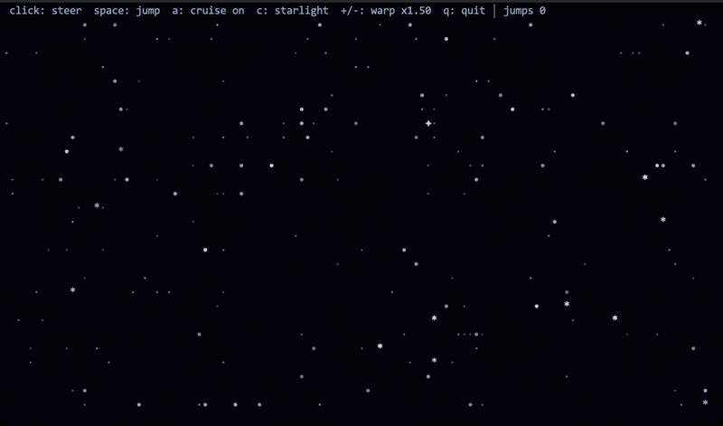

The same flight projected onto the cell grid at half-cell vertical
resolution, each star picking a glyph from a depth ramp (`· • * ✦`) and
brightening as it approaches.

### plasma

The classic demoscene plasma: interfering sine fields that breathe and
shift colour. Press `c` to cycle palettes, click to move the wave centre.

#### kitty graphics — `plasma-gfx`

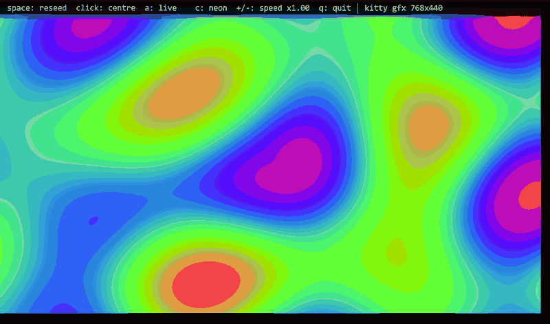

Every pixel sums four sine waves — one of them radial, around a centre you
can drag with the mouse — and looks the result up in an Inigo Quilez cosine
palette that drifts over time, so smooth colour bands roll across the frame.

#### ASCII cells — `plasma`


The same field sampled per cell, each character chosen from a brightness
ramp (`·:+*x#%@`) and tinted with the palette colour.

### tunnel

An endless flight down a textured throat, steering wherever you click.

#### kitty graphics — `tunnel-gfx`


Each pixel is remapped to polar coordinates around a centre: the angle wraps
the wall and `1/radius` becomes depth, so a scrolling sine-band texture
rushes toward you. Distance fog sinks the throat into black, and the centre
drifts on a Lissajous until you grab it.

#### ASCII cells — `tunnel`

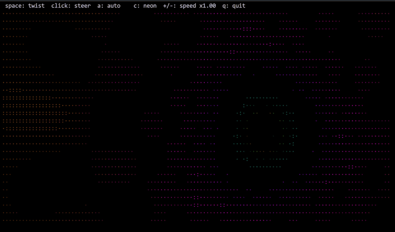

The same polar warp on the cell grid, brightness picking the glyph and the
palette the colour.

### aurora

Northern lights: slow curtains of green and violet light over a transparent
night sky.

#### kitty graphics — `aurora-gfx`

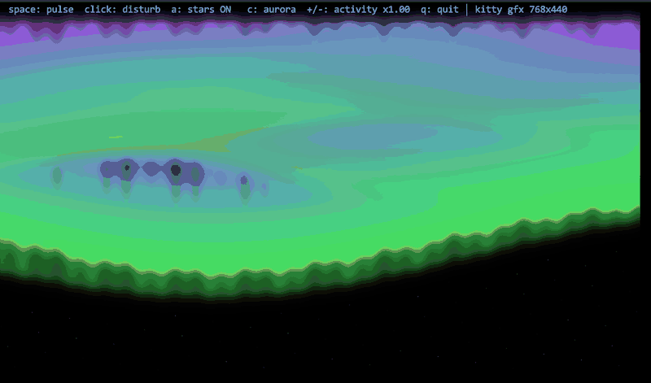

Several swaying curtains — each a sine-driven height with a soft upward glow
— are summed and tinted by height and intensity. Alpha follows the light, so
the dark sky is your real terminal background and only the glow is opaque;
`a` toggles a dusting of stars.

#### ASCII cells — `aurora`

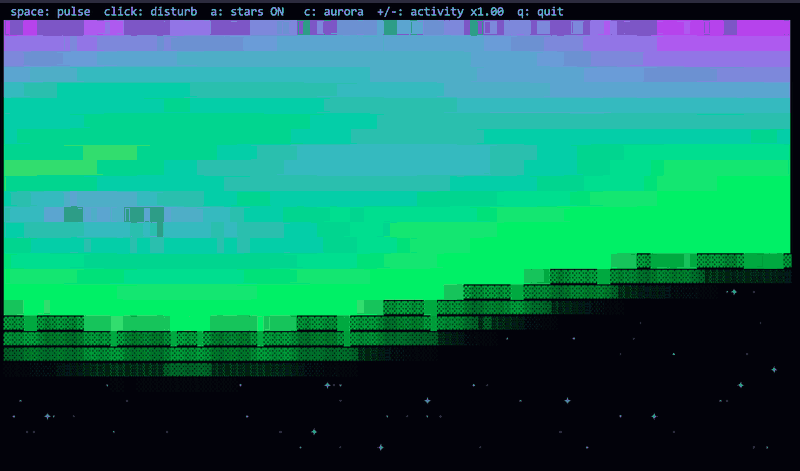

Columns of shaded glyphs lit by the same curtains, sparse where the sky is
dark.

### julia

An animated Julia-set fractal whose seed constant wanders the edge of the
Mandelbrot cardioid.

#### kitty graphics — `julia-gfx`


Per-pixel escape-time iteration with smooth (fractional) colouring through a
cycling palette, so the filaments glow without banding. The constant `c`
glides on a loop, jumps to a new shape on `space`, or snaps to wherever you
click.

#### ASCII cells — `julia`


The same escape count mapped to a `.:-=+*#%@` ramp and palette colour.

### metaballs

A lava lamp: soft blobs that drift, merge, and split.

#### kitty graphics — `metaballs-gfx`

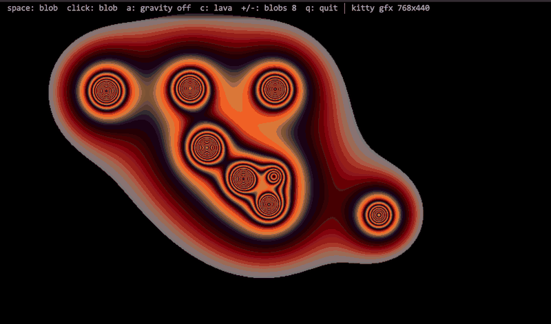

Each pixel sums an inverse-square field from every blob — below a threshold
it stays transparent, just above it gets a bright rim, and the interior
fills with palette-shaded goo, so overlapping blobs melt into one smooth
surface floating over your terminal.

#### ASCII cells — `metaballs`

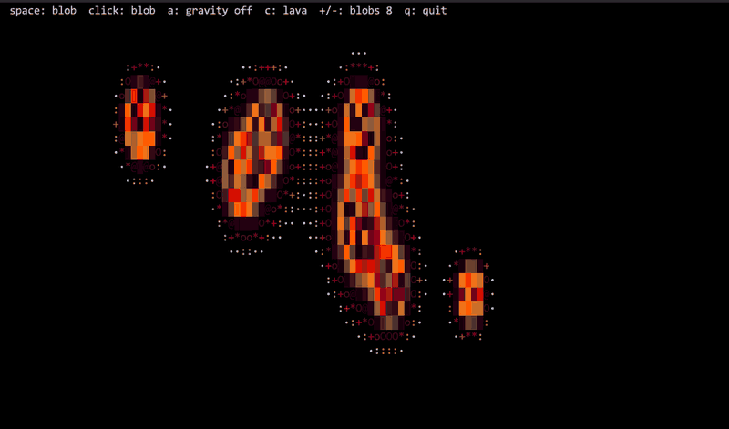

The same field as a glyph ramp running from a sparse rim to a solid core.

### boids

An emergent flock that swirls, splits at a predator, and re-forms.

#### kitty graphics — `boids-gfx`

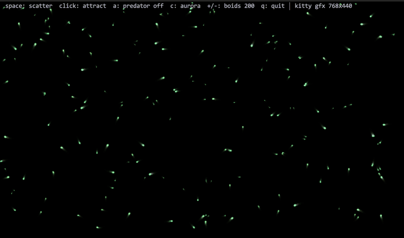

A few hundred boids run Reynolds' separation / alignment / cohesion rules;
each is an additive glow coloured by heading, drawn into a framebuffer that
decays instead of clearing — so the flock trails motion-blur ribbons.

#### ASCII cells — `boids`

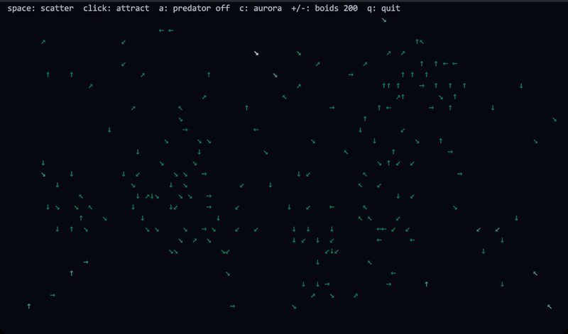

Each boid becomes a directional arrow glyph coloured by speed.

### lightning

Branching bolts that fork across the sky and flash the whole frame.

#### kitty graphics — `lightning-gfx`

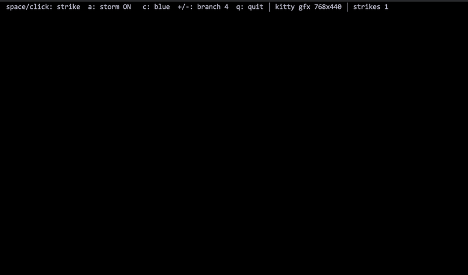

Bolts are built by midpoint displacement — random perpendicular kicks with
probabilistic branches — and drawn as additive glowing lines into a decaying
buffer; every strike adds a translucent flash that fades over a few frames.

#### ASCII cells — `lightning`

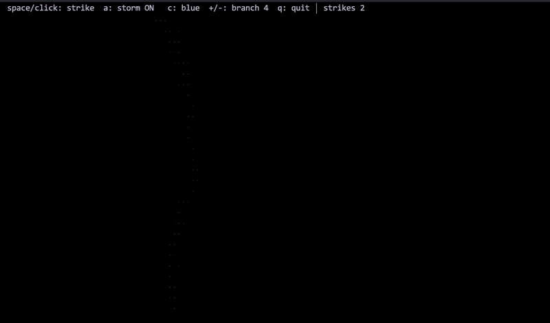

Bolts rasterised with line and fork glyphs over a per-cell brightness buffer
that decays after the flash.

### snow

A quiet snowfall with wind and a drift that builds along the floor.

#### kitty graphics — `snow-gfx`

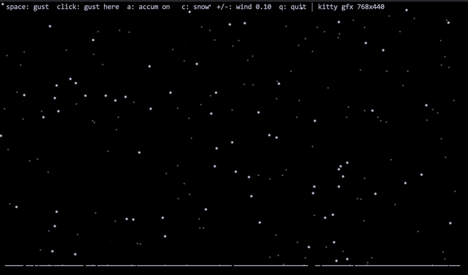

Hundreds of flakes fall in three parallax layers with per-flake sway and a
wind that gusts; an accumulation height-field grows where flakes land and
slowly settles into mounds. The sky is transparent, the snow opaque.

#### ASCII cells — `snow`

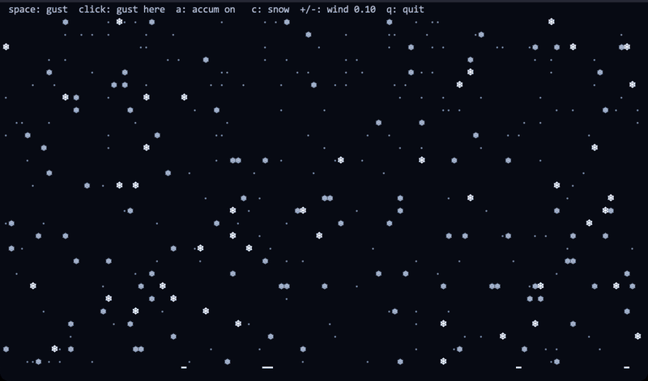

Flakes pick a glyph by depth layer (`❄ ❅ * ·`) and the drift is drawn with
block glyphs along the bottom. `c` swaps snow for ash, cherry petals, or rain.

### sand

A falling-sand toy: pour materials and watch them pile and flow.

#### kitty graphics — `sand-gfx`

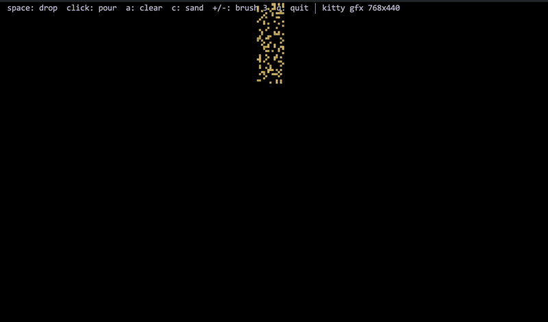

A cellular automaton on a grid of materials, updated bottom-up every frame —
sand piles at its angle of repose, water and oil level out (and oil floats
up through water), embers glow and cool. Filled grains opaque, empty cells
transparent over your terminal.

#### ASCII cells — `sand`

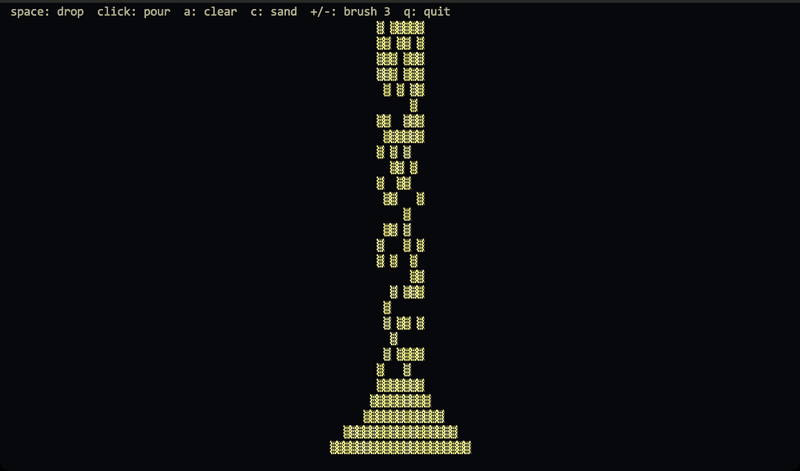

The same grid at half-cell resolution, each material its own glyph and colour.

### smoke

Ink billowing through an invisible current.

#### kitty graphics — `smoke-gfx`

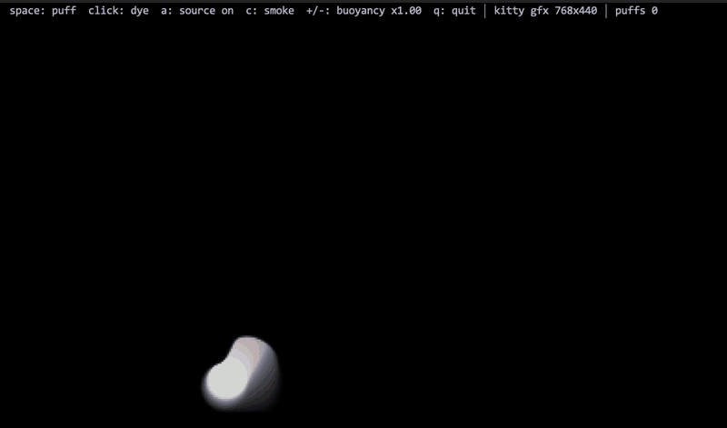

A density field is advected by semi-Lagrangian backtrace through a procedural
curl-noise flow plus buoyancy, dissipating as it climbs; alpha follows
density so the smoke drifts over your terminal. `c` swaps grey smoke for
coloured ink.

#### ASCII cells — `smoke`

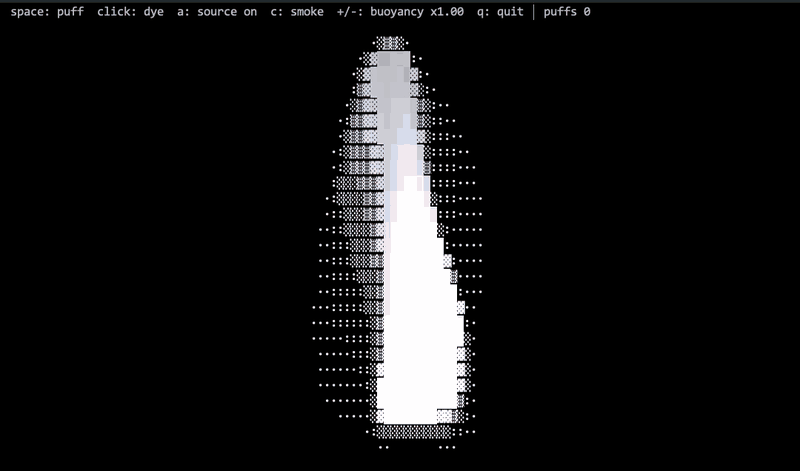

Density mapped to a `·:░▒▓█` ramp and the dye colour.

### coral

A Gray-Scott reaction-diffusion system growing coral, spots, and mazes.

#### kitty graphics — `coral-gfx`

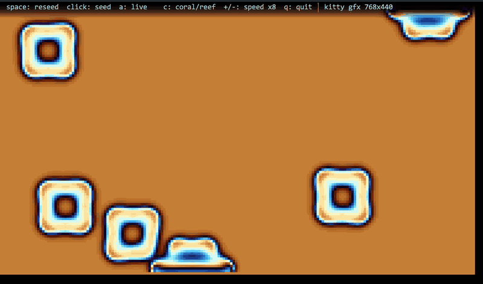

Two chemicals diffuse and react across the grid; mapping the inhibitor
through a palette reveals patterns that grow and divide forever. `c` cycles
presets (coral, mitosis, spots, maze, waves) that completely change the
morphology.

#### ASCII cells — `coral`


The same chemical field as a glyph-and-colour ramp — lower resolution, same
restless life.

### donut

The spinning torus, in its two most famous renderings.

#### kitty graphics — `donut-gfx`

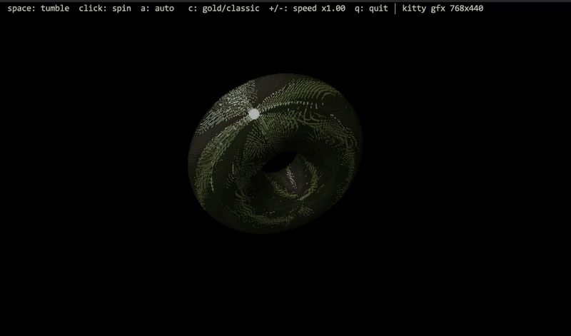

A parametric torus is rotated on two axes, perspective-projected, and lit per
surface point; a z-buffer keeps the near face in front while each point
splats a shaded disc tinted by a palette, with specular highlights toward
white.

#### ASCII cells — `donut`

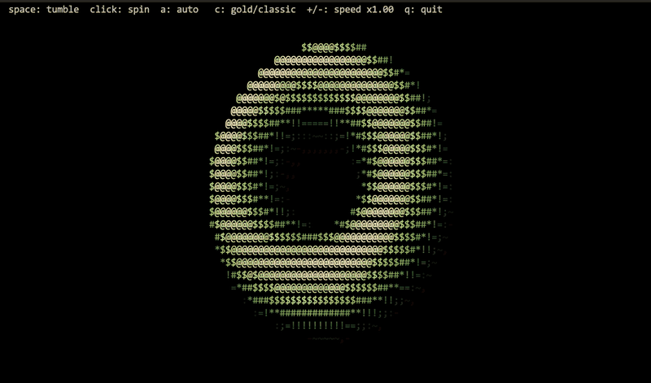

Andy Sloane's ASCII donut — the same maths z-buffered onto the cell grid
through the `.,-~:;=!*#$@` luminance ramp, here coloured by the palette. `c`
cycles palettes and tube shapes.

## Controls

`q` or `Esc` quits every demo. The rest of the keys share a vocabulary —
`space` is the main action, a mouse click does it at the pointer, `a` toggles
something, `c` cycles a colour scheme / preset, and `+` / `-` nudge a rate:

| Demo | `space` | mouse click | `a` | `c` | `+` / `-` |
|---|---|---|---|---|---|
| fireworks | launch a rocket | rocket at the pointer | toggle the auto show | — | auto launch rate |
| matrix | spawn a wave of drops | drop at the pointer | — | cycle colour scheme | fall speed |
| ripples | drop a stone | stone at the pointer | toggle the rain | cycle colour scheme | rain rate |
| fire | flare the burner | fireball at the pointer | snuff / relight | cycle colour scheme | flame height |
| starfield | hyperjump | steer to the pointer | toggle the autopilot | cycle colour scheme | warp speed |
| plasma | reseed the wave centre | set centre at the pointer | freeze the animation | cycle palette | speed |
| tunnel | twist | steer the centre | toggle centre autopilot | cycle palette | fly speed |
| aurora | pulse the curtains | disturb the curtain | toggle stars | cycle palette | activity |
| julia | jump to a new seed | set the seed | toggle autopilot | cycle palette | iteration detail |
| metaballs | add a blob | blob at the pointer | toggle gravity | cycle palette | blob count |
| boids | scatter the flock | attractor at the pointer | toggle a predator | cycle colour scheme | flock size |
| lightning | strike | strike to the pointer | toggle the auto-storm | cycle tint | branchiness |
| snow | gust | gust at the pointer | toggle accumulation | cycle type | wind strength |
| sand | drop a chunk | pour at the pointer | clear the field | cycle material | brush size |
| smoke | puff | inject dye | toggle the source | cycle dye colour | buoyancy |
| coral | reseed | seed at the pointer | pause | cycle preset / palette | sim speed |
| donut | tumble | spin toward the pointer | toggle autopilot | cycle palette / shape | spin speed |

## Tuning

Each demo reads env vars with its own prefix (`FIREWORKS_*`, `MATRIX_*`,
`RIPPLES_*`, `FIRE_*`, `STARFIELD_*`, `PLASMA_*`, `TUNNEL_*`, `AURORA_*`,
`JULIA_*`, `METABALLS_*`, `BOIDS_*`, `LIGHTNING_*`, `SNOW_*`, `SAND_*`,
`SMOKE_*`, `CORAL_*`, `DONUT_*`):

| Env var | Default | Effect |
|---|---|---|
| `*_FPS` | demo-specific | target frame rate (gfx) |
| `*_MAXDIM` | `512` | framebuffer size cap; `1024` for sharper, larger frames |
| `*_CELLS` | unset | set to force cell rendering even on kitty terminals |

Frames are uncompressed base64 RGBA, so bandwidth scales with
`MAXDIM`² × `FPS` — if a remote connection feels sluggish, turn one of them
down.

## How pixel mode works

Graphics support is detected **before** termpaint takes over the tty: the
demo asks the terminal to *validate* (not display) a 1×1 image and chases it
with a DA1 query. Every terminal answers DA1; only kitty-protocol terminals
answer the graphics query first (`kitty_gfx.c`).

Each frame is then transmitted as a chunked, base64-encoded RGBA image
(`a=T,f=32`) stretched over the full cell grid, layered above the text with
alpha. Old frames are deleted by id after the replacement is on screen.

`kitty_probe.c` is a standalone tool that runs the same detection by hand and
hex-dumps the terminal's raw replies — handy for checking what your terminal
and multiplexer actually pass through:

```sh
./build/kitty_probe
```

## Project layout

| File | What |
|---|---|
| `fireworks.c`, `fireworks-gfx.c` | fireworks demo (cells / kitty pixels) |
| `matrix.c`, `matrix-gfx.c` | digital rain demo (cells / kitty pixels) |
| `ripples.c`, `ripples-gfx.c` | water ripples demo (cells / kitty pixels) |
| `fire.c`, `fire-gfx.c` | demoscene fire demo (cells / kitty pixels) |
| `starfield.c`, `starfield-gfx.c` | warp starfield demo (cells / kitty pixels) |
| `plasma.c`, `plasma-gfx.c` | demoscene plasma demo (cells / kitty pixels) |
| `tunnel.c`, `tunnel-gfx.c` | texture tunnel demo (cells / kitty pixels) |
| `aurora.c`, `aurora-gfx.c` | northern lights demo (cells / kitty pixels) |
| `julia.c`, `julia-gfx.c` | Julia-set fractal demo (cells / kitty pixels) |
| `metaballs.c`, `metaballs-gfx.c` | lava-lamp metaballs demo (cells / kitty pixels) |
| `boids.c`, `boids-gfx.c` | flocking boids demo (cells / kitty pixels) |
| `lightning.c`, `lightning-gfx.c` | branching lightning demo (cells / kitty pixels) |
| `snow.c`, `snow-gfx.c` | snowfall demo (cells / kitty pixels) |
| `sand.c`, `sand-gfx.c` | falling-sand demo (cells / kitty pixels) |
| `smoke.c`, `smoke-gfx.c` | smoke / ink fluid demo (cells / kitty pixels) |
| `coral.c`, `coral-gfx.c` | reaction-diffusion demo (cells / kitty pixels) |
| `donut.c`, `donut-gfx.c` | spinning torus demo (cells / kitty pixels) |
| `kitty_gfx.{c,h}` | minimal kitty graphics protocol support library |
| `kitty_probe.c` | terminal graphics-support probe |
| `tools/` | recording & screenshot harness for the README media |
| `termpaint/` | [termpaint](https://github.com/termpaint/termpaint) submodule |

*All recordings are real terminal sessions: captured from iTerm2 with
`tools/record_iterm.py`, which launches each demo in a window, drives it,
and assembles the frames into the GIFs above.*

## License

Demo code is [0BSD](https://spdx.org/licenses/0BSD.html). termpaint is
[Boost Software License 1.0](https://github.com/termpaint/termpaint/blob/master/COPYING).
