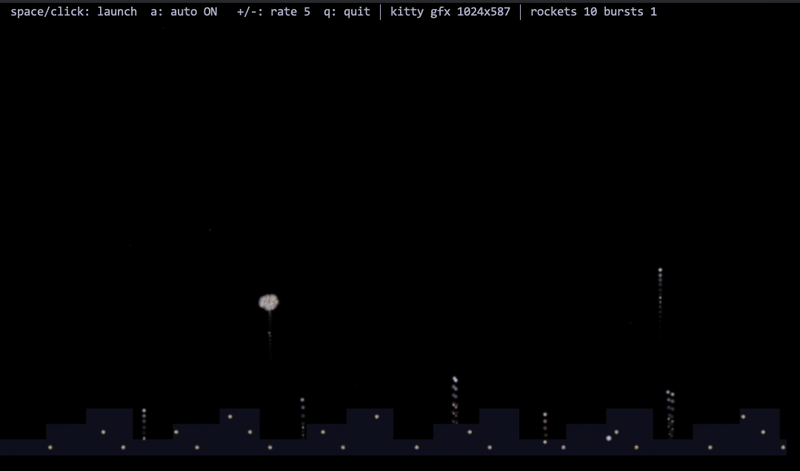
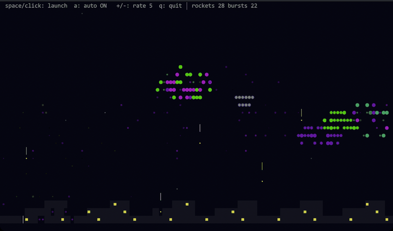
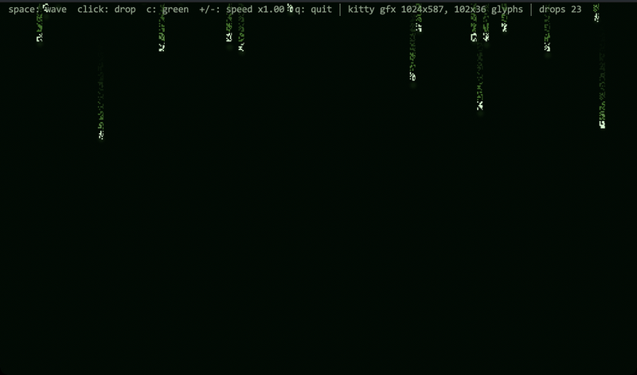
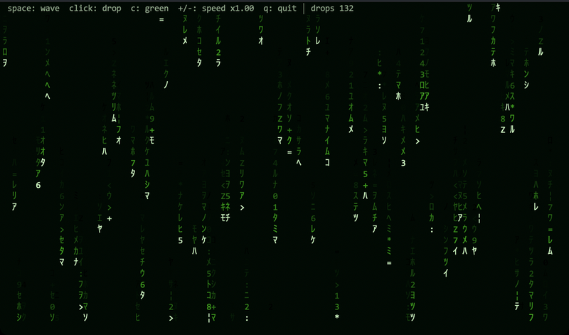
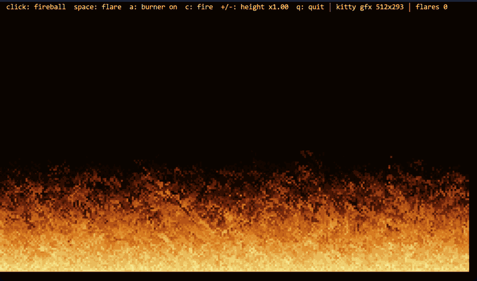
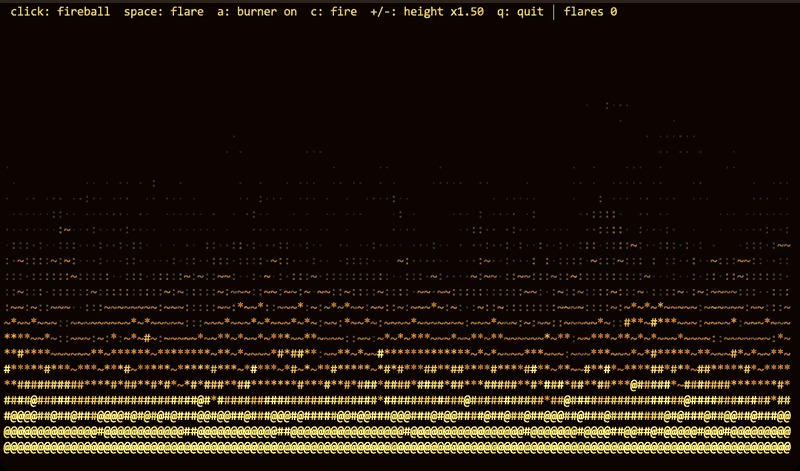

# termfun 🎆

Eye-candy demos for your terminal — each at two resolutions.



Small C demos built on [termpaint](https://github.com/termpaint/termpaint).
Each one renders as classic ASCII cells everywhere, and at **pixel
resolution** on terminals that speak the
[kitty graphics protocol](https://sw.kovidgoyal.net/kitty/graphics-protocol/)
(kitty, iTerm2, WezTerm, ...).

No dependencies beyond a C compiler and `make` — termpaint is vendored as a
submodule and built into the binaries.

## Quick start

```sh
git clone --recurse-submodules https://github.com/binRick/termfun.git
cd termfun
make
./build/fireworks-gfx     # pixel mode on kitty-protocol terminals, cells elsewhere
./build/matrix-gfx
./build/ripples-gfx
./build/fire-gfx
./build/fireworks         # pure cell versions
./build/matrix
./build/ripples
./build/fire
```

If you already cloned without `--recurse-submodules`, `make` initializes the
submodule for you. The `make run-<demo>` targets (`run`, `run-gfx`,
`run-matrix-gfx`, `run-ripples-gfx`, ...) build and launch in one step; the
`./*.sh` scripts do the same.

## The demos

All recordings below are real iTerm2 sessions running the demos.

### fireworks

Rockets, bursts, a twinkling sky, and a city skyline.

#### kitty graphics — `fireworks-gfx`


Renders into an RGBA framebuffer transmitted to the terminal every frame:

- **Additive glow** — sparks are radial gradients that sum into the
  framebuffer, so overlapping bursts get hot in the middle.
- **Decay trails** — every channel decays toward zero each frame instead of
  being cleared, so rockets and sparks leave natural fading streaks.
- **Transparent sky** — alpha follows the glow, so the status bar and your
  terminal background show through where nothing is burning.
- **Tear-free** — frames are double-buffered image ids wrapped in
  synchronized-output (`DECSET 2026`), so cells and pixels land atomically.

#### ASCII cells — `fireworks`



Pure termpaint: particles pick a glyph by intensity (`✸ ● • ·`), positions are
tracked at half-cell vertical resolution, and the skyline windows flicker.
This is also exactly what `fireworks-gfx` shows on terminals without graphics
support.

### matrix

Digital rain with half-width katakana, bright stream heads, and fading tails.
Press `c` to cycle colour schemes (green, cyan, amber, ...).

#### kitty graphics — `matrix-gfx`



The rain falls on its own pixel glyph grid, denser than the cell grid, using
randomly generated 5×7 bitmap glyphs with a phosphor glow around each stream
head.

#### ASCII cells — `matrix`



Text-glyph rain on the cell grid. On kitty-protocol terminals this version
adds a soft pixel bloom layer around the stream heads; set `MATRIX_CELLS=1`
for the pure text experience shown here.

### ripples

A rain-dappled pool: a damped wave equation lit by the slope of the
surface, with sun-coloured glints on the steepest crests. Click anywhere
to toss in a stone.

#### kitty graphics — `ripples-gfx`


The wave field runs at framebuffer resolution and every pixel is shaded
by its slope, as if lit from the upper left; steep crests spill over into
a specular sun colour. The pool's alpha fades out under the status bar.

#### ASCII cells — `ripples`


The same waves on a half-cell-resolution height field: each cell averages
two sim rows and picks from a calm-to-sparkle glyph ramp (`· ~ ≈ ✦`),
brightening with the lit side of each swell.

### fire

The classic demoscene fire: a heat field that cools in chunky random
quanta as it rises, carving the flames into ragged tongues. Click to lob
a fireball, space to flare the burner, `a` to snuff it and watch the
flames die out.

#### kitty graphics — `fire-gfx`



The Doom fire algorithm on 2×2 pixel blocks: every cell scatters its heat
to a randomly jittered spot one row up — the collisions and holes are
what keep the tongues coherent. Alpha follows the heat, so the flames
burn straight over your terminal background.

#### ASCII cells — `fire`



The same heat field at half-cell resolution, rendered as an
ember-to-blaze glyph ramp (`· : ~ * # @`) through a four-stop palette —
`c` swaps fire for blue gas, toxic green, or violet plasma.

## Controls

| Key | fireworks | matrix | ripples | fire |
|---|---|---|---|---|
| `space` | launch a rocket | spawn a wave of drops | drop a stone | flare the burner |
| mouse click | rocket at the pointer | drop at the pointer | stone at the pointer | fireball at the pointer |
| `a` | toggle the auto show | — | toggle the rain | snuff/relight the burner |
| `c` | — | cycle the colour scheme | cycle the colour scheme | cycle the colour scheme |
| `+` / `-` | auto launch rate | fall speed | rain rate | flame height |
| `q` / `Esc` | quit | quit | quit | quit |

## Tuning

Each demo reads env vars with its own prefix (`FIREWORKS_*`, `MATRIX_*`,
`RIPPLES_*`, `FIRE_*`):

| Env var | Default | Effect |
|---|---|---|
| `*_FPS` | demo-specific | target frame rate (gfx) |
| `*_MAXDIM` | `512` | framebuffer size cap; `1024` for sharper, larger frames |
| `*_CELLS` | unset | set to force cell rendering even on kitty terminals |

Frames are uncompressed base64 RGBA, so bandwidth scales with
`MAXDIM`² × `FPS` — if a remote connection feels sluggish, turn one of them
down.

## How pixel mode works

Graphics support is detected **before** termpaint takes over the tty: the
demo asks the terminal to *validate* (not display) a 1×1 image and chases it
with a DA1 query. Every terminal answers DA1; only kitty-protocol terminals
answer the graphics query first (`kitty_gfx.c`).

Each frame is then transmitted as a chunked, base64-encoded RGBA image
(`a=T,f=32`) stretched over the full cell grid, layered above the text with
alpha. Old frames are deleted by id after the replacement is on screen.

`kitty_probe.c` is a standalone tool that runs the same detection by hand and
hex-dumps the terminal's raw replies — handy for checking what your terminal
and multiplexer actually pass through:

```sh
./build/kitty_probe
```

## Project layout

| File | What |
|---|---|
| `fireworks.c`, `fireworks-gfx.c` | fireworks demo (cells / kitty pixels) |
| `matrix.c`, `matrix-gfx.c` | digital rain demo (cells / kitty pixels) |
| `ripples.c`, `ripples-gfx.c` | water ripples demo (cells / kitty pixels) |
| `fire.c`, `fire-gfx.c` | demoscene fire demo (cells / kitty pixels) |
| `kitty_gfx.{c,h}` | minimal kitty graphics protocol support library |
| `kitty_probe.c` | terminal graphics-support probe |
| `tools/` | recording & screenshot harness for the README media |
| `termpaint/` | [termpaint](https://github.com/termpaint/termpaint) submodule |

*All recordings are real terminal sessions: captured from iTerm2 with
`tools/record_iterm.py`, which launches each demo in a window, drives it,
and assembles the frames into the GIFs above.*

## License

Demo code is [0BSD](https://spdx.org/licenses/0BSD.html). termpaint is
[Boost Software License 1.0](https://github.com/termpaint/termpaint/blob/master/COPYING).
